# فهرس اللقطات — Shot index

مولَّد آليًا بـ `tools/shot_index.py` — لا تعدّله يدويًا. كل لقطة: موضعها في الفيلم (من–إلى)، المشهد، طريقة الإنتاج، الشخصيات، الجملة المنطوقة، الصورة المفتاحية، المقطع، والحالة.
Auto-generated by `tools/shot_index.py` — do not edit by hand.
**الإجمالي:** clip_done: 8 · kf_done: 169

## الجزء 1

### S01 — الإطار: النار والصخرة  `00:00–00:50`

| # | الصورة | اللقطة | الموضع | المدة | الطريقة | الشخصيات | الصوت | المقطع | الحالة |
|---|---|---|---|---|---|---|---|---|---|
| 1 |  | `S01-01` | `00:00–00:08` | 8ث | T2V | — | 🔊 wind, single long imzad note | — | kf_done |
| 2 |  | `S01-02` | `00:08–00:15` | 7ث | KF2V | GRANDMOTHER, ILYAS | 🔊 fire crackle | — | kf_done |
| 3 |  | `S01-03` | `00:15–00:21` | 6ث | KF2V | ILYAS | 🔊 finger on stone | — | kf_done |
| 4 |  | `S01-04` | `00:21–00:27` | 6ث | KF2V | ILYAS | إيلياس: جدّتي… من كتب هذا؟ | — | kf_done |
| 5 |  | `S01-05` | `00:27–00:35` | 8ث | KF2V | GRANDMOTHER | الجدّة: هذا؟ هذا كتبه رجلٌ كان يخاف أن يُنسى. | — | kf_done |
| 6 |  | `S01-06` | `00:35–00:43` | 8ث | KF2V | — | 🔊 music swell (imzad) | — | kf_done |
| 7 | [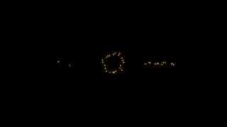](../renders/clips/S01-07.mp4) | `S01-07` | `00:43–00:50` | 7ث | HF | — |  | [mp4](../renders/clips/S01-07.mp4) | clip_done |

### S02 — زمن الحجر الليّن  `00:50–01:50`

| # | الصورة | اللقطة | الموضع | المدة | الطريقة | الشخصيات | الصوت | المقطع | الحالة |
|---|---|---|---|---|---|---|---|---|---|
| 1 |  | `S02-01` | `00:50–00:58` | 8ث | T2V | — | راوية: في البدء… كانت الحجارة ليّنة كالطين. كان كلّ من يمشي يترك أثرًا لا يزول. | — | kf_done |
| 2 |  | `S02-02` | `00:58–01:06` | 8ث | T2V | AJABBAR | 🔊 deep soft thuds | — | kf_done |
| 3 |  | `S02-03` | `01:06–01:14` | 8ث | T2V | AJABBAR |  | — | kf_done |
| 4 |  | `S02-04` | `01:14–01:21` | 7ث | T2V | — |  | — | kf_done |
| 5 |  | `S02-05` | `01:21–01:29` | 8ث | KF2V | AJABBAR | راوية: كان العمالقة أقوياء… لكنهم لم يعرفوا الكلام الذي يبقى. رسموا على الصخر، ولم يفهم رسمَهم أحد. | — | kf_done |
| 6 |  | `S02-06` | `01:29–01:38` | 9ث | T2V | — | راوية: ثم جاء زمن الوضوح… زمن أمامّلن. | — | kf_done |
| 7 | [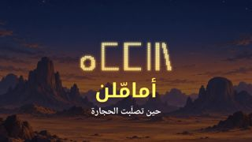](../renders/clips/S02-07.mp4) | `S02-07` | `01:38–01:50` | 12ث | HF | — | 🔊 tende hit + imzad theme | [mp4](../renders/clips/S02-07.mp4) | clip_done |

### S03 — صاحب الوضوح  `01:50–03:00`

| # | الصورة | اللقطة | الموضع | المدة | الطريقة | الشخصيات | الصوت | المقطع | الحالة |
|---|---|---|---|---|---|---|---|---|---|
| 1 |  | `S03-01` | `01:50–01:57` | 7ث | T2V | — | 🔊 camels, distant voices | — | kf_done |
| 2 |  | `S03-02` | `01:57–02:04` | 7ث | KF2V | AMAMELLEN |  | — | kf_done |
| 3 |  | `S03-03` | `02:04–02:10` | 6ث | KF2V | — | شيخ: ما الذي يمشي بلا أقدام، ويشرب بلا فم، ويموت إذا وقف؟ | — | kf_done |
| 4 |  | `S03-04` | `02:10–02:16` | 6ث | KF2V | AMAMELLEN | أمامّلن: النهر… والزمن. | — | kf_done |
| 5 |  | `S03-05` | `02:16–02:22` | 6ث | KF2V | — | 🔊 ululation, murmurs | — | kf_done |
| 6 |  | `S03-06` | `02:22–02:30` | 8ث | KF2V | AMAMELLEN | راوية: كانوا يسمّونه «صاحب الوضوح». لم يغلبه لغزٌ قط. | — | kf_done |
| 7 |  | `S03-07` | `02:30–02:38` | 8ث | T2V | — |  | — | kf_done |
| 8 |  | `S03-08` | `02:38–02:46` | 8ث | KF2V | TANFUST | قارئة الرمل: الولد الذي في بطنك… سيرى أبعد من خاله. | — | kf_done |
| 9 |  | `S03-09` | `02:46–02:52` | 6ث | KF2V | — |  | — | kf_done |
| 10 |  | `S03-10` | `02:52–03:00` | 8ث | KF2V | AMAMELLEN | 🔊 gust | — | kf_done |

### S04 — لعبة النقاط  `03:00–04:10`

| # | الصورة | اللقطة | الموضع | المدة | الطريقة | الشخصيات | الصوت | المقطع | الحالة |
|---|---|---|---|---|---|---|---|---|---|
| 1 |  | `S04-01` | `03:00–03:07` | 7ث | KF2V | AMAMELLEN | 🔊 baby cry, ululation | — | kf_done |
| 2 |  | `S04-02` | `03:07–03:16` | 9ث | KF2V | AMAMELLEN, ADELASEGH, TAFUKT | أمامّلن: نقطتان تعني «ماء». دائرة تعني «مخيّم». هذه لعبتنا… لا يعرفها أحدٌ غيرنا. | — | kf_done |
| 3 |  | `S04-03` | `03:16–03:23` | 7ث | KF2V | — |  | — | kf_done |
| 4 |  | `S04-04` | `03:23–03:29` | 6ث | KF2V | ADELASEGH, TAFUKT | 🔊 kids laughing | — | kf_done |
| 5 |  | `S04-05` | `03:29–03:36` | 7ث | KF2V | ADELASEGH |  | — | kf_done |
| 6 |  | `S04-06` | `03:36–03:44` | 8ث | KF2V | ADELASEGH, AMAMELLEN | أدلاسغ (12 سنة): الظلّ! يا خالي، الظلّ! | — | kf_done |
| 7 |  | `S04-07` | `03:44–03:50` | 6ث | KF2V | AMAMELLEN | 🔊 laughter | — | kf_done |
| 8 |  | `S04-08` | `03:50–03:58` | 8ث | KF2V | AMAMELLEN | راوية: ومنذ ذلك اليوم… صار في قلب الخال حجرٌ صغير. حجرٌ لم يكن ليّنًا. | — | kf_done |
| 9 |  | `S04-09` | `03:58–04:10` | 12ث | KF2V | ADELASEGH | 🔊 wind whoosh, flute motif | — | kf_done |

### S05 — الفخ الأول: بئر كل إسوف  `04:10–05:30`

| # | الصورة | اللقطة | الموضع | المدة | الطريقة | الشخصيات | الصوت | المقطع | الحالة |
|---|---|---|---|---|---|---|---|---|---|
| 1 |  | `S05-01` | `04:10–04:18` | 8ث | KF2V | AMAMELLEN, ADELASEGH | أمامّلن: الماء في بئرنا مُرّ. اذهب إلى البئر البيضاء وراء السهل، وائتِنا بماءٍ عذب. | [mp4](../renders/clips/S05-01.mp4) | clip_done |
| 2 |  | `S05-02` | `04:18–04:24` | 6ث | KF2V | TANFUST | تانفوست: تلك بئر «كل إسوف»… لا يعود منها أحد. | — | kf_done |
| 3 |  | `S05-03` | `04:24–04:30` | 6ث | KF2V | ADELASEGH | أدلاسغ: إذن سأكون أول من يعود. | — | kf_done |
| 4 |  | `S05-04` | `04:30–04:38` | 8ث | T2V | ADELASEGH | 🔊 total silence, high whine | — | kf_done |
| 5 |  | `S05-05` | `04:38–04:45` | 7ث | KF2V | ADELASEGH |  | — | kf_done |
| 6 |  | `S05-06` | `04:45–04:53` | 8ث | KF2V | ADELASEGH | أرواح (همس): من يشرب من بئرنا… يبقى معنا. | — | kf_done |
| 7 |  | `S05-07` | `04:53–04:59` | 6ث | KF2V | ADELASEGH | أدلاسغ: لكم لغزٌ أولًا: من يقف أمامكم ولا تستطيعون لمسه؟ | — | kf_done |
| 8 |  | `S05-08` | `04:59–05:07` | 8ث | KF2V | ADELASEGH |  | — | kf_done |
| 9 |  | `S05-09` | `05:07–05:15` | 8ث | KF2V | ADELASEGH | أدلاسغ: الجواب: أنتم. | — | kf_done |
| 10 |  | `S05-10` | `05:15–05:23` | 8ث | KF2V | ADELASEGH | 🔊 cheers, ululation | — | kf_done |
| 11 |  | `S05-11` | `05:23–05:30` | 7ث | KF2V | AMAMELLEN |  | — | kf_done |

### S06 — الفخ الثاني: القربة المثقوبة  `05:30–06:50`

| # | الصورة | اللقطة | الموضع | المدة | الطريقة | الشخصيات | الصوت | المقطع | الحالة |
|---|---|---|---|---|---|---|---|---|---|
| 1 |  | `S06-01` | `05:30–05:38` | 8ث | KF2V | AMAMELLEN | 🔊 leather creak | — | kf_done |
| 2 |  | `S06-02` | `05:38–05:44` | 6ث | KF2V | AMAMELLEN |  | — | kf_done |
| 3 |  | `S06-03` | `05:44–05:52` | 8ث | T2V | ADELASEGH | راوية: أرسله خاله بقافلة إلى تنزروفت… أرض العطش، بقربة تبكي ماءها قطرةً قطرة. | — | kf_done |
| 4 |  | `S06-04` | `05:52–05:58` | 6ث | KF2V | — | 🔊 drip, sizzle | — | kf_done |
| 5 |  | `S06-05` | `05:58–06:05` | 7ث | KF2V | ADELASEGH |  | — | kf_done |
| 6 |  | `S06-06` | `06:05–06:13` | 8ث | KF2V | ADELASEGH | 🔊 night wind, jackal far | — | kf_done |
| 7 |  | `S06-07` | `06:13–06:20` | 7ث | KF2V | — | أدلاسغ (لنفسه): النمل لا يحمل حبًّا إلى حيث لا ماء. | — | kf_done |
| 8 |  | `S06-08` | `06:20–06:28` | 8ث | KF2V | ADELASEGH | 🔊 water splash, camel groan | — | kf_done |
| 9 |  | `S06-09` | `06:28–06:36` | 8ث | KF2V | ADELASEGH | 🔊 kids shouting | — | kf_done |
| 10 |  | `S06-10` | `06:36–06:43` | 7ث | KF2V | AMAMELLEN, ADELASEGH | أدلاسغ: قربتك يا خالي… كانت عطشى أكثر مني. | — | kf_done |
| 11 |  | `S06-11` | `06:43–06:50` | 7ث | KF2V | TANFUST, AMAMELLEN | 🔊 silence | — | kf_done |

### S07 — الفخ الثالث: صدع الأسكرام  `06:50–08:20`

| # | الصورة | اللقطة | الموضع | المدة | الطريقة | الشخصيات | الصوت | المقطع | الحالة |
|---|---|---|---|---|---|---|---|---|---|
| 1 |  | `S07-01` | `06:50–06:58` | 8ث | T2V | AMAMELLEN, ADELASEGH | 🔊 high wind | — | kf_done |
| 2 |  | `S07-02` | `06:58–07:05` | 7ث | KF2V | AMAMELLEN, ADELASEGH | أمامّلن: في قاع ذلك الصدع نبتة لا تنبت إلا هنا. أمّك مريضة… انزل. | — | kf_done |
| 3 |  | `S07-03` | `07:05–07:11` | 6ث | KF2V | ADELASEGH |  | — | kf_done |
| 4 |  | `S07-04` | `07:11–07:17` | 6ث | KF2V | AMAMELLEN | 🔊 rope snap | — | kf_done |
| 5 |  | `S07-05` | `07:17–07:23` | 6ث | KF2V | ADELASEGH | 🔊 then silence | — | kf_done |
| 6 |  | `S07-06` | `07:23–07:30` | 7ث | KF2V | AMAMELLEN |  | — | kf_done |
| 7 |  | `S07-07` | `07:30–07:37` | 7ث | KF2V | ADELASEGH |  | — | kf_done |
| 8 |  | `S07-08` | `07:37–07:45` | 8ث | KF2V | ADELASEGH | 🔊 effort breaths | — | kf_done |
| 9 |  | `S07-09` | `07:45–07:53` | 8ث | KF2V | AMAMELLEN, ADELASEGH |  | — | kf_done |
| 10 |  | `S07-10` | `07:53–08:00` | 7ث | KF2V | AMAMELLEN, ADELASEGH |  | — | kf_done |
| 11 |  | `S07-11` | `08:00–08:10` | 10ث | KF2V | AMAMELLEN, ADELASEGH | أدلاسغ: لغزٌ يا خالي. ما الذي لا يستطيع الأب أن يعطيه… ولا يستطيع الخال أن يأخذه… ويحمله ابن الأخت؟ | — | kf_done |
| 12 |  | `S07-12` | `08:10–08:20` | 10ث | KF2V | AMAMELLEN | أمامّلن: …الدم. دم أمّك. اسمي… من بعدي. | — | kf_done |

### S08 — المصالحة وتصلّب الحجر  `08:20–09:30`

| # | الصورة | اللقطة | الموضع | المدة | الطريقة | الشخصيات | الصوت | المقطع | الحالة |
|---|---|---|---|---|---|---|---|---|---|
| 1 |  | `S08-01` | `08:20–08:29` | 9ث | KF2V | AMAMELLEN, ADELASEGH |  | [mp4](../renders/clips/S08-01.mp4) | clip_done |
| 2 |  | `S08-02` | `08:29–08:38` | 9ث | KF2V | AMAMELLEN | أمامّلن: لم أكن أخاف منك. كنت أخاف أن تراني أصغُر… أن يأتي يومٌ لا يذكرني فيه أحد. | — | kf_done |
| 3 |  | `S08-03` | `08:38–08:45` | 7ث | KF2V | ADELASEGH | أدلاسغ: وكيف يُنسى من حفر كل هذه الألغاز في رؤوسنا؟ | — | kf_done |
| 4 |  | `S08-04` | `08:45–08:54` | 9ث | T2V | — | 🔊 music rises | — | kf_done |
| 5 |  | `S08-05` | `08:54–09:02` | 8ث | KF2V | AMAMELLEN, ADELASEGH |  | — | kf_done |
| 6 |  | `S08-06` | `09:02–09:12` | 10ث | T2V | — | راوية: في ذلك الفجر… تصلّبت الحجارة. ولم يعد أحدٌ يترك أثرًا. | — | kf_done |
| 7 |  | `S08-07` | `09:12–09:20` | 8ث | KF2V | AMAMELLEN |  | — | kf_done |
| 8 |  | `S08-08` | `09:20–09:30` | 10ث | KF2V | AMAMELLEN, ADELASEGH | أمامّلن: انتهى زمن الأثر يا ابن أختي. | — | kf_done |

### S09 — الغبار في الأفق  `09:30–10:00`

| # | الصورة | اللقطة | الموضع | المدة | الطريقة | الشخصيات | الصوت | المقطع | الحالة |
|---|---|---|---|---|---|---|---|---|---|
| 1 |  | `S09-01` | `09:30–09:38` | 8ث | KF2V | ADELASEGH, AMAMELLEN | أدلاسغ: خالي… تافوكت في المخيّم. | — | kf_done |
| 2 |  | `S09-02` | `09:38–09:46` | 8ث | T2V | — | 🔊 distant rumble | — | kf_done |
| 3 |  | `S09-03` | `09:46–09:52` | 6ث | KF2V | AMAMELLEN | 🔊 sound drops out, single tende drum hit | — | kf_done |
| 4 |  | `S09-04` | `09:52–10:00` | 8ث | HF | — |  | [mp4](../renders/clips/S09-04.mp4) | clip_done |

## الجزء 2

### S10 — الغارة  `10:00–11:20`

| # | الصورة | اللقطة | الموضع | المدة | الطريقة | الشخصيات | الصوت | المقطع | الحالة |
|---|---|---|---|---|---|---|---|---|---|
| 1 | [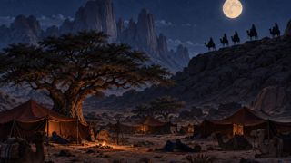](../renders/keyframes/S10-01.jpg) | `S10-01` | `10:00–10:08` | 8ث | T2V | — | راوية: وفي تلك الليلة… بينما كان الخال وابن أخته على القمّة، جاء أهل الليل. | — | kf_done |
| 2 | [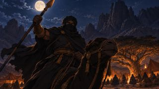](../renders/keyframes/S10-02.jpg) | `S10-02` | `10:08–10:12` | 4ث | KF2V | RAIDCHIEF | 🔊 war cry | — | kf_done |
| 3 | [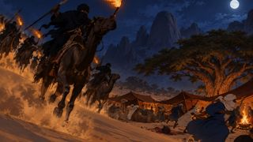](../renders/keyframes/S10-03.jpg) | `S10-03` | `10:12–10:17` | 5ث | T2V | — | 🔊 thunder of camels, ululating war cries | — | kf_done |
| 4 | [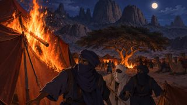](../renders/keyframes/S10-04.jpg) | `S10-04` | `10:17–10:21` | 4ث | KF2V | — | 🔊 fire whoosh | — | kf_done |
| 5 | [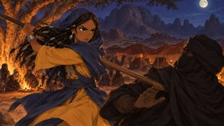](../renders/keyframes/S10-05.jpg) | `S10-05` | `10:21–10:26` | 5ث | KF2V | TAFUKT | 🔊 wood strike, shout | — | kf_done |
| 6 | [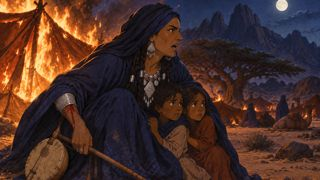](../renders/keyframes/S10-06.jpg) | `S10-06` | `10:26–10:31` | 5ث | KF2V | TANFUST | 🔊 scream | — | kf_done |
| 7 | [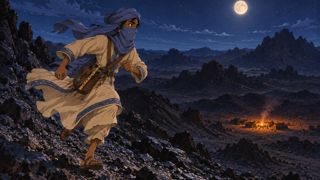](../renders/keyframes/S10-07.jpg) | `S10-07` | `10:31–10:37` | 6ث | KF2V | ADELASEGH | 🔊 running breath, distant cries | — | kf_done |
| 8 | [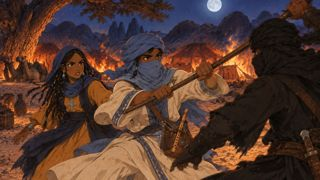](../renders/keyframes/S10-08.jpg) | `S10-08` | `10:37–10:42` | 5ث | KF2V | ADELASEGH, TAFUKT | 🔊 staff strikes | — | kf_done |
| 9 | [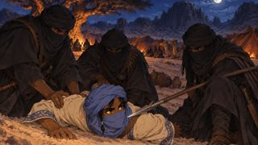](../renders/keyframes/S10-09.jpg) | `S10-09` | `10:42–10:47` | 5ث | KF2V | ADELASEGH | 🔊 thud, grunt | — | kf_done |
| 10 | [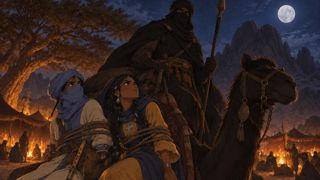](../renders/keyframes/S10-10.jpg) | `S10-10` | `10:47–10:53` | 6ث | KF2V | RAIDCHIEF, ADELASEGH, TAFUKT | زعيم كل إهاد: الأذكياء يُباعون بثمنٍ أعلى. | — | kf_done |
| 11 | [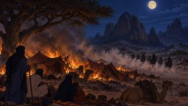](../renders/keyframes/S10-11.jpg) | `S10-11` | `10:53–10:59` | 6ث | T2V | — | 🔊 galloping fades, crackling fire | — | kf_done |
| 12 | [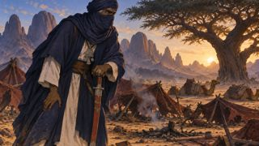](../renders/keyframes/S10-12.jpg) | `S10-12` | `10:59–11:06` | 7ث | KF2V | AMAMELLEN | 🔊 heavy breathing, wind | — | kf_done |
| 13 | [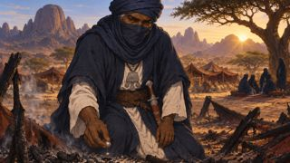](../renders/keyframes/S10-13.jpg) | `S10-13` | `11:06–11:13` | 7ث | KF2V | AMAMELLEN |  | — | kf_done |
| 14 |  | `S10-14` | `11:13–11:20` | 7ث | T2V | — | 🔊 wind hiss | — | kf_done |

### S11 — لا أثر  `11:20–12:30`

| # | الصورة | اللقطة | الموضع | المدة | الطريقة | الشخصيات | الصوت | المقطع | الحالة |
|---|---|---|---|---|---|---|---|---|---|
| 1 | [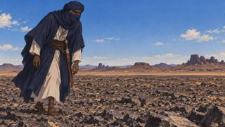](../renders/keyframes/S11-01.jpg) | `S11-01` | `11:20–11:28` | 8ث | KF2V | AMAMELLEN | 🔊 wind, footsteps on gravel | — | kf_done |
| 2 | [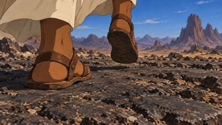](../renders/keyframes/S11-02.jpg) | `S11-02` | `11:28–11:34` | 6ث | KF2V | — | 🔊 stone tap | — | kf_done |
| 3 | [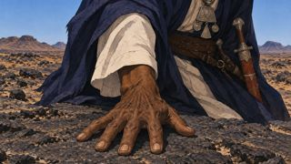](../renders/keyframes/S11-03.jpg) | `S11-03` | `11:34–11:43` | 9ث | KF2V | AMAMELLEN | راوية: الحجر الذي صالحَه… صار الحجر الذي يخفي عنه أحبّته. | — | kf_done |
| 4 | [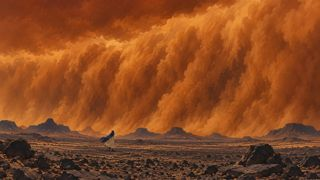](../renders/keyframes/S11-04.jpg) | `S11-04` | `11:43–11:51` | 8ث | T2V | — | 🔊 roaring storm | — | kf_done |
| 5 | [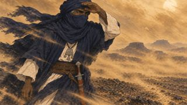](../renders/keyframes/S11-05.jpg) | `S11-05` | `11:51–11:57` | 6ث | KF2V | AMAMELLEN | 🔊 storm | — | kf_done |
| 6 |  | `S11-06` | `11:57–12:06` | 9ث | KF2V | TANFUST | 🔊 imzad solo | — | kf_done |
| 7 | [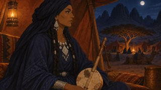](../renders/keyframes/S11-07.jpg) | `S11-07` | `12:06–12:15` | 9ث | KF2V | TANFUST | تانفوست: يا من يحلّ كل لغز… حلّ هذا: كيف تكلّم من لا تراه؟ | — | kf_done |
| 8 | [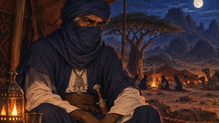](../renders/keyframes/S11-08.jpg) | `S11-08` | `12:15–12:22` | 7ث | KF2V | AMAMELLEN | 🔊 silence, lamp flicker | — | kf_done |
| 9 | [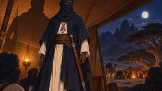](../renders/keyframes/S11-09.jpg) | `S11-09` | `12:22–12:30` | 8ث | KF2V | AMAMELLEN | أمامّلن: العمالقة. هم وحدهم عاشوا قبل أن يتصلّب الحجر. | — | kf_done |

### S12 — آخر العمالقة  `12:30–14:30`

| # | الصورة | اللقطة | الموضع | المدة | الطريقة | الشخصيات | الصوت | المقطع | الحالة |
|---|---|---|---|---|---|---|---|---|---|
| 1 | [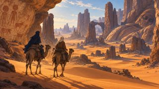](../renders/keyframes/S12-01.jpg) | `S12-01` | `12:30–12:38` | 8ث | KF2V | AMAMELLEN, AGEZMI | 🔊 wind, camel bells | — | kf_done |
| 2 | [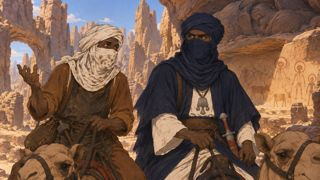](../renders/keyframes/S12-02.jpg) | `S12-02` | `12:38–12:47` | 9ث | KF2V | AGEZMI, AMAMELLEN | أغ إزمي (ساخرًا): نذهب لنسأل عملاقًا نائمًا منذ ألف عام. فكرة عظيمة يا صاحب الوضوح. | — | kf_done |
| 3 | [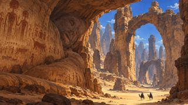](../renders/keyframes/S12-03.jpg) | `S12-03` | `12:47–12:54` | 7ث | T2V | — | 🔊 echoing wind | — | kf_done |
| 4 | [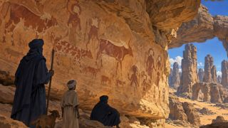](../renders/keyframes/S12-04.jpg) | `S12-04` | `12:54–13:01` | 7ث | KF2V | — |  | — | kf_done |
| 5 | [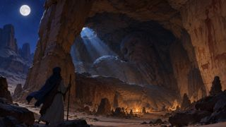](../renders/keyframes/S12-05.jpg) | `S12-05` | `13:01–13:08` | 7ث | T2V | — | 🔊 deep slow breathing of stone | — | kf_done |
| 6 |  | `S12-06` | `13:08–13:15` | 7ث | KF2V | AMAMELLEN, AGEZMI |  | — | kf_done |
| 7 |  | `S12-07` | `13:15–13:23` | 8ث | KF2V | AMAMELLEN | أمامّلن: ما الذي ينام ألف عام… ويستيقظ بكلمة؟ | — | kf_done |
| 8 | [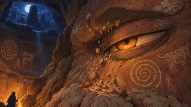](../renders/keyframes/S12-08.jpg) | `S12-08` | `13:23–13:30` | 7ث | KF2V | AJABBAR | 🔊 deep rumble, grinding stone | — | kf_done |
| 9 | [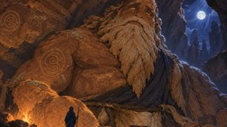](../renders/keyframes/S12-09.jpg) | `S12-09` | `13:30–13:41` | 11ث | KF2V | AJABBAR | أجبّار (بطيئًا): صغيرٌ أنت… ومستعجل. نحن تركنا آثارنا في كل مكان. انظر إلى الجدران. | — | kf_done |
| 10 | [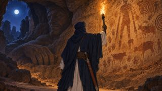](../renders/keyframes/S12-10.jpg) | `S12-10` | `13:41–13:48` | 7ث | KF2V | AMAMELLEN | أمامّلن: أرى رسومًا… لكني لا أفهمها. | — | kf_done |
| 11 | [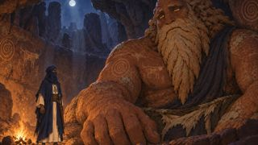](../renders/keyframes/S12-11.jpg) | `S12-11` | `13:48–13:57` | 9ث | KF2V | AJABBAR, AMAMELLEN | أجبّار: لهذا ماتت. العلامة لا تحيا إلا إذا عرف أحدٌ كيف يقرؤها. | — | kf_done |
| 12 | [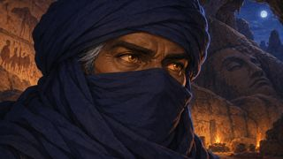](../renders/keyframes/S12-12.jpg) | `S12-12` | `13:57–14:06` | 9ث | KF2V | AMAMELLEN | أجبّار: أنتم البشر تموتون سريعًا… فاتركوا علامةً يقرؤها من بعدكم. | — | kf_done |
| 13 |  | `S12-13` | `14:06–14:14` | 8ث | T2V | — | 🔊 music rises | — | kf_done |
| 14 | [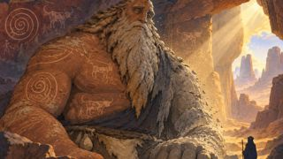](../renders/keyframes/S12-14.jpg) | `S12-14` | `14:14–14:23` | 9ث | KF2V | AJABBAR | 🔊 deep crackle, long exhale | — | kf_done |
| 15 | [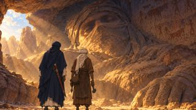](../renders/keyframes/S12-15.jpg) | `S12-15` | `14:23–14:30` | 7ث | KF2V | AMAMELLEN, AGEZMI |  | — | kf_done |

### S13 — مبارزة الألغاز والهروب  `14:30–16:00`

| # | الصورة | اللقطة | الموضع | المدة | الطريقة | الشخصيات | الصوت | المقطع | الحالة |
|---|---|---|---|---|---|---|---|---|---|
| 1 | [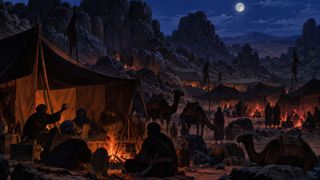](../renders/keyframes/S13-01.jpg) | `S13-01` | `14:30–14:37` | 7ث | T2V | — | 🔊 fire, rough laughter | — | kf_done |
| 2 | [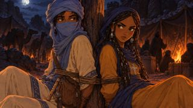](../renders/keyframes/S13-02.jpg) | `S13-02` | `14:37–14:43` | 6ث | KF2V | ADELASEGH, TAFUKT |  | — | kf_done |
| 3 | [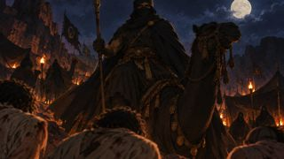](../renders/keyframes/S13-03.jpg) | `S13-03` | `14:43–14:50` | 7ث | KF2V | RAIDCHIEF | زعيم كل إهاد: ابنُ أخت الحكيم… مقيّدٌ كالماعز. | — | kf_done |
| 4 | [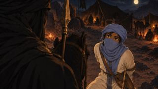](../renders/keyframes/S13-04.jpg) | `S13-04` | `14:50–14:59` | 9ث | KF2V | ADELASEGH, RAIDCHIEF | أدلاسغ: لنتبارز بالألغاز. إن غلبتك فكّ يديّ. وإن غلبتني فأنا عبدك بلا ثمن. | — | kf_done |
| 5 | [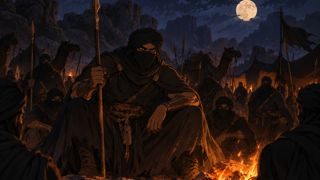](../renders/keyframes/S13-05.jpg) | `S13-05` | `14:59–15:06` | 7ث | KF2V | RAIDCHIEF | زعيم كل إهاد: ما الذي يأكل ولا يشبع؟ | — | kf_done |
| 6 | [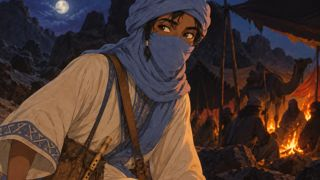](../renders/keyframes/S13-06.jpg) | `S13-06` | `15:06–15:12` | 6ث | KF2V | ADELASEGH | أدلاسغ: النار. والآن أنا: ما الذي له عنقٌ وليس له رأس؟ | — | kf_done |
| 7 | [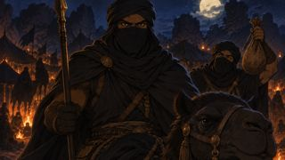](../renders/keyframes/S13-07.jpg) | `S13-07` | `15:12–15:19` | 7ث | KF2V | RAIDCHIEF | أدلاسغ: القِربة. وآخر: ما الذي تملكه أنت… ويستعمله الناس أكثر منك؟ | — | kf_done |
| 8 | [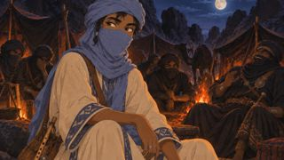](../renders/keyframes/S13-08.jpg) | `S13-08` | `15:19–15:25` | 6ث | KF2V | ADELASEGH | أدلاسغ: اسمك… ولا أحد هنا يعرف اسمك. | — | kf_done |
| 9 | [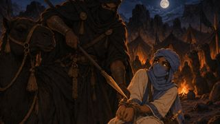](../renders/keyframes/S13-09.jpg) | `S13-09` | `15:25–15:31` | 6ث | KF2V | RAIDCHIEF, ADELASEGH | زعيم كل إهاد: فكّوا يديه. | — | kf_done |
| 10 | [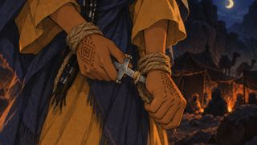](../renders/keyframes/S13-10.jpg) | `S13-10` | `15:31–15:37` | 6ث | KF2V | TAFUKT | 🔊 rope fibres snapping | — | kf_done |
| 11 | [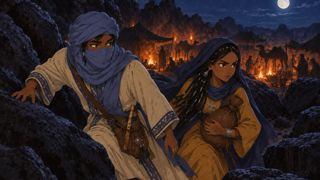](../renders/keyframes/S13-11.jpg) | `S13-11` | `15:37–15:44` | 7ث | KF2V | ADELASEGH, TAFUKT | 🔊 quick footsteps | — | kf_done |
| 12 | [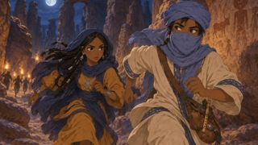](../renders/keyframes/S13-12.jpg) | `S13-12` | `15:44–15:50` | 6ث | T2V | ADELASEGH, TAFUKT | 🔊 panting, distant shouts | — | kf_done |
| 13 | [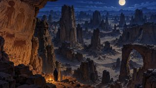](../renders/keyframes/S13-13.jpg) | `S13-13` | `15:50–16:00` | 10ث | T2V | — | 🔊 silence, wind | — | kf_done |

### S14 — اختراع الحروف  `16:00–17:30`

| # | الصورة | اللقطة | الموضع | المدة | الطريقة | الشخصيات | الصوت | المقطع | الحالة |
|---|---|---|---|---|---|---|---|---|---|
| 1 | [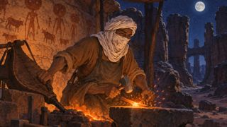](../renders/keyframes/S14-01.jpg) | `S14-01` | `16:00–16:07` | 7ث | KF2V | AGEZMI | 🔊 hammer on iron, bellows | — | kf_done |
| 2 |  | `S14-02` | `16:07–16:13` | 6ث | KF2V | — | 🔊 hiss | — | kf_done |
| 3 | [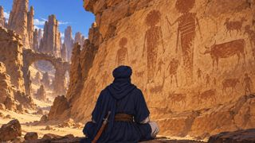](../renders/keyframes/S14-03.jpg) | `S14-03` | `16:13–16:21` | 8ث | KF2V | AMAMELLEN | 🔊 wind | — | kf_done |
| 4 |  | `S14-04` | `16:21–16:28` | 7ث | KF2V | — |  | — | kf_done |
| 5 |  | `S14-05` | `16:28–16:36` | 8ث | KF2V | AMAMELLEN | أمامّلن (همسًا): لعبتنا… هم وحدهم يعرفونها. | — | kf_done |
| 6 |  | `S14-06` | `16:36–16:44` | 8ث | HF | — | 🔊 chisel taps in rhythm, imzad | [mp4](../renders/clips/S14-06.mp4) | clip_done |
| 7 |  | `S14-07` | `16:44–16:51` | 7ث | KF2V | AMAMELLEN | 🔊 chisel taps | — | kf_done |
| 8 |  | `S14-08` | `16:51–16:58` | 7ث | KF2V | AMAMELLEN | 🔊 chisel taps | — | kf_done |
| 9 |  | `S14-09` | `16:58–17:05` | 7ث | KF2V | AMAMELLEN | 🔊 chisel taps, night wind | — | kf_done |
| 10 |  | `S14-10` | `17:05–17:11` | 6ث | KF2V | AMAMELLEN | 🔊 rain on stone | — | kf_done |
| 11 |  | `S14-11` | `17:11–17:17` | 6ث | KF2V | — | 🔊 a single tap | — | kf_done |
| 12 |  | `S14-12` | `17:17–17:24` | 7ث | KF2V | AMAMELLEN | راوية: نقش على الحجر الذي لا ينسى… كلامًا لا يفهمه إلا اثنان. | — | kf_done |
| 13 |  | `S14-13` | `17:24–17:30` | 6ث | KF2V | AMAMELLEN |  | — | kf_done |

### S15 — قراءة العلامات  `17:30–19:00`

| # | الصورة | اللقطة | الموضع | المدة | الطريقة | الشخصيات | الصوت | المقطع | الحالة |
|---|---|---|---|---|---|---|---|---|---|
| 1 |  | `S15-01` | `17:30–17:38` | 8ث | KF2V | TAFUKT, ADELASEGH | 🔊 wind, laboured breathing | — | kf_done |
| 2 |  | `S15-02` | `17:38–17:44` | 6ث | KF2V | TAFUKT |  | — | kf_done |
| 3 |  | `S15-03` | `17:44–17:51` | 7ث | HF | — | 🔊 music sting (DOTS motif) | [mp4](../renders/clips/S15-03.mp4) | clip_done |
| 4 |  | `S15-04` | `17:51–17:58` | 7ث | KF2V | TAFUKT, ADELASEGH | تافوكت: أدلاسغ! لعبة خالي! | — | kf_done |
| 5 |  | `S15-05` | `17:58–18:06` | 8ث | KF2V | ADELASEGH | أدلاسغ (يقرأ بأصابعه): ماء… يومان… شرقًا. | — | kf_done |
| 6 |  | `S15-06` | `18:06–18:14` | 8ث | KF2V | ADELASEGH, TAFUKT | 🔊 water splash, relieved laugh | — | kf_done |
| 7 |  | `S15-07` | `18:14–18:21` | 7ث | T2V | ADELASEGH, TAFUKT | 🔊 wind, flute motif | — | kf_done |
| 8 |  | `S15-08` | `18:21–18:28` | 7ث | KF2V | RAIDCHIEF | 🔊 camels snorting | — | kf_done |
| 9 |  | `S15-09` | `18:28–18:36` | 8ث | KF2V | ADELASEGH | أدلاسغ (وهو يحفر): والآن… علامةٌ لهم. | — | kf_done |
| 10 |  | `S15-10` | `18:36–18:43` | 7ث | T2V | — | 🔊 echoing angry shouts | — | kf_done |
| 11 |  | `S15-11` | `18:43–18:51` | 8ث | KF2V | TAFUKT | 🔊 laughter | — | kf_done |
| 12 |  | `S15-12` | `18:51–19:00` | 9ث | KF2V | ADELASEGH, TAFUKT | 🔊 flute motif | — | kf_done |

### S16 — الصخرة الأخيرة  `19:00–20:30`

| # | الصورة | اللقطة | الموضع | المدة | الطريقة | الشخصيات | الصوت | المقطع | الحالة |
|---|---|---|---|---|---|---|---|---|---|
| 1 |  | `S16-01` | `19:00–19:08` | 8ث | T2V | — | 🔊 wind, distant camel | — | kf_done |
| 2 |  | `S16-02` | `19:08–19:16` | 8ث | KF2V | AMAMELLEN | 🔊 slow breathing | — | kf_done |
| 3 |  | `S16-03` | `19:16–19:23` | 7ث | KF2V | AMAMELLEN |  | — | kf_done |
| 4 |  | `S16-04` | `19:23–19:32` | 9ث | KF2V | AMAMELLEN | أمامّلن (ضعيفًا، مبتسم العينين): لغزٌ أخير… ما الذي يبقى بعد أن يموت صاحبه؟ | — | kf_done |
| 5 |  | `S16-05` | `19:32–19:41` | 9ث | KF2V | ADELASEGH | أدلاسغ (يركع، يضع يده على النقش): الكلمة يا خالي. الكلمة المكتوبة. | — | kf_done |
| 6 |  | `S16-06` | `19:41–19:49` | 8ث | KF2V | AMAMELLEN, ADELASEGH | 🔊 leather creak | — | kf_done |
| 7 |  | `S16-07` | `19:49–19:58` | 9ث | KF2V | AMAMELLEN, ADELASEGH | أمامّلن: اسمي من بعدي… صار في يدك. | — | kf_done |
| 8 |  | `S16-08` | `19:58–20:05` | 7ث | KF2V | — | 🔊 music swell (THEME_A) | — | kf_done |
| 9 |  | `S16-09` | `20:05–20:13` | 8ث | KF2V | TAFUKT, AMAMELLEN |  | — | kf_done |
| 10 |  | `S16-10` | `20:13–20:21` | 8ث | T2V | — | 🔊 distant ululation | — | kf_done |
| 11 |  | `S16-11` | `20:21–20:30` | 9ث | KF2V | AMAMELLEN, ADELASEGH, TAFUKT |  | — | kf_done |

### S17 — تصلّبت الحجارة كي تبقى الكلمات  `20:30–21:30`

| # | الصورة | اللقطة | الموضع | المدة | الطريقة | الشخصيات | الصوت | المقطع | الحالة |
|---|---|---|---|---|---|---|---|---|---|
| 1 |  | `S17-01` | `20:30–20:39` | 9ث | KF2V | AMAMELLEN | 🔊 children's voices | — | kf_done |
| 2 |  | `S17-02` | `20:39–20:47` | 8ث | KF2V | ADELASEGH, TANFUST | 🔊 imzad | — | kf_done |
| 3 |  | `S17-03` | `20:47–20:55` | 8ث | KF2V | TAFUKT | 🔊 chisel taps | — | kf_done |
| 4 |  | `S17-04` | `20:55–21:04` | 9ث | KF2V | AMAMELLEN | أمامّلن: تصلّبت الحجارة… كي تبقى الكلمات. | — | kf_done |
| 5 |  | `S17-05` | `21:04–21:12` | 8ث | T2V | — | 🔊 music swell | — | kf_done |
| 6 |  | `S17-06` | `21:12–21:22` | 10ث | T2V | — | راوية: ومات أمامّلن كما يموت الناس… لكنّ كلماته لم تمت. | — | kf_done |
| 7 |  | `S17-07` | `21:22–21:30` | 8ث | KF2V | — | راوية: ما زالت هناك، على الصخر، لمن يعرف كيف يقرأ. | — | kf_done |

### S18 — الخاتمة  `21:30–22:00`

| # | الصورة | اللقطة | الموضع | المدة | الطريقة | الشخصيات | الصوت | المقطع | الحالة |
|---|---|---|---|---|---|---|---|---|---|
| 1 |  | `S18-01` | `21:30–21:38` | 8ث | KF2V | GRANDMOTHER, ILYAS | 🔊 fire crackle | — | kf_done |
| 2 |  | `S18-02` | `21:38–21:45` | 7ث | KF2V | ILYAS | إيلياس: ماء… يومان… شرقًا. | — | kf_done |
| 3 |  | `S18-03` | `21:45–21:51` | 6ث | KF2V | GRANDMOTHER | الجدّة: والآن… صرتَ أنت أيضًا تعرف اللعبة. | — | kf_done |
| 4 |  | `S18-04` | `21:51–22:00` | 9ث | HF | — | 🔊 imzad THEME_A, final tende hit | [mp4](../renders/clips/S18-04.mp4) | clip_done |
