# فهرس اللقطات — Shot index

مولَّد آليًا بـ `tools/shot_index.py` — لا تعدّله يدويًا. كل لقطة: موضعها في الفيلم (من–إلى)، المشهد، طريقة الإنتاج، الشخصيات، الجملة المنطوقة، الصورة المفتاحية، المقطع، والحالة.
Auto-generated by `tools/shot_index.py` — do not edit by hand.
**الإجمالي:** clip_done: 5 · kf_done: 74

## الجزء 1

### S01 — الإطار: النار والصخرة  `00:00–00:50`

| # | الصورة | اللقطة | الموضع | المدة | الطريقة | الشخصيات | الصوت | المقطع | الحالة |
|---|---|---|---|---|---|---|---|---|---|
| 1 | [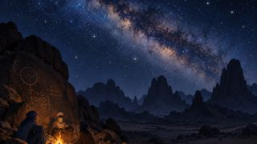](../renders/keyframes/S01-01.jpg) | `S01-01` | `00:00–00:08` | 8ث | T2V | — | 🔊 wind, single long imzad note | — | kf_done |
| 2 |  | `S01-02` | `00:08–00:15` | 7ث | KF2V | GRANDMOTHER, ILYAS | 🔊 fire crackle | — | kf_done |
| 3 |  | `S01-03` | `00:15–00:21` | 6ث | KF2V | ILYAS | 🔊 finger on stone | — | kf_done |
| 4 |  | `S01-04` | `00:21–00:27` | 6ث | KF2V | ILYAS | إيلياس: جدّتي… من كتب هذا؟ | — | kf_done |
| 5 | [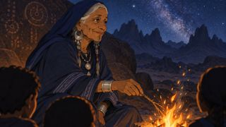](../renders/keyframes/S01-05.jpg) | `S01-05` | `00:27–00:35` | 8ث | KF2V | GRANDMOTHER | الجدّة: هذا؟ هذا كتبه رجلٌ كان يخاف أن يُنسى. | — | kf_done |
| 6 | [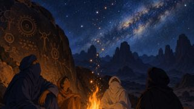](../renders/keyframes/S01-06.jpg) | `S01-06` | `00:35–00:43` | 8ث | KF2V | — | 🔊 music swell (imzad) | — | kf_done |
| 7 | رسوم HF | `S01-07` | `00:43–00:50` | 7ث | HF | — |  | [mp4](../renders/clips/S01-07.mp4) | clip_done |

### S02 — زمن الحجر الليّن  `00:50–01:50`

| # | الصورة | اللقطة | الموضع | المدة | الطريقة | الشخصيات | الصوت | المقطع | الحالة |
|---|---|---|---|---|---|---|---|---|---|
| 1 | [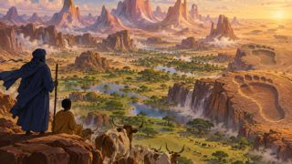](../renders/keyframes/S02-01.jpg) | `S02-01` | `00:50–00:58` | 8ث | T2V | — | راوية: في البدء… كانت الحجارة ليّنة كالطين. كان كلّ من يمشي يترك أثرًا لا يزول. | — | kf_done |
| 2 |  | `S02-02` | `00:58–01:06` | 8ث | T2V | AJABBAR | 🔊 deep soft thuds | — | kf_done |
| 3 | [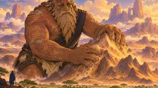](../renders/keyframes/S02-03.jpg) | `S02-03` | `01:06–01:14` | 8ث | T2V | AJABBAR |  | — | kf_done |
| 4 | [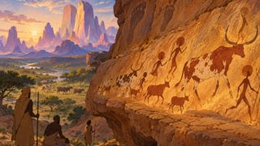](../renders/keyframes/S02-04.jpg) | `S02-04` | `01:14–01:21` | 7ث | T2V | — |  | — | kf_done |
| 5 |  | `S02-05` | `01:21–01:29` | 8ث | KF2V | AJABBAR | راوية: كان العمالقة أقوياء… لكنهم لم يعرفوا الكلام الذي يبقى. رسموا على الصخر، ولم يفهم رسمَهم أحد. | — | kf_done |
| 6 | [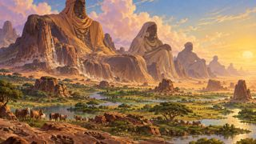](../renders/keyframes/S02-06.jpg) | `S02-06` | `01:29–01:38` | 9ث | T2V | — | راوية: ثم جاء زمن الوضوح… زمن أمامّلن. | — | kf_done |
| 7 | رسوم HF | `S02-07` | `01:38–01:50` | 12ث | HF | — | 🔊 tende hit + imzad theme | [mp4](../renders/clips/S02-07.mp4) | clip_done |

### S03 — صاحب الوضوح  `01:50–03:00`

| # | الصورة | اللقطة | الموضع | المدة | الطريقة | الشخصيات | الصوت | المقطع | الحالة |
|---|---|---|---|---|---|---|---|---|---|
| 1 | [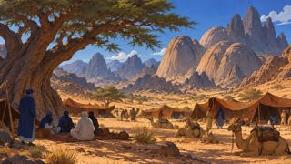](../renders/keyframes/S03-01.jpg) | `S03-01` | `01:50–01:57` | 7ث | T2V | — | 🔊 camels, distant voices | — | kf_done |
| 2 | [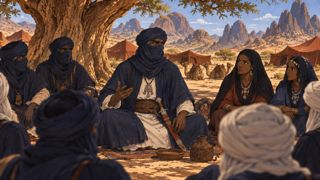](../renders/keyframes/S03-02.jpg) | `S03-02` | `01:57–02:04` | 7ث | KF2V | AMAMELLEN |  | — | kf_done |
| 3 | [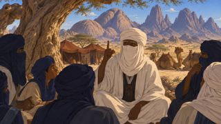](../renders/keyframes/S03-03.jpg) | `S03-03` | `02:04–02:10` | 6ث | KF2V | — | شيخ: ما الذي يمشي بلا أقدام، ويشرب بلا فم، ويموت إذا وقف؟ | — | kf_done |
| 4 | [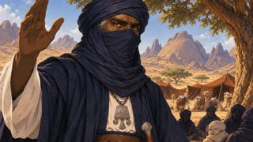](../renders/keyframes/S03-04.jpg) | `S03-04` | `02:10–02:16` | 6ث | KF2V | AMAMELLEN | أمامّلن: النهر… والزمن. | — | kf_done |
| 5 | [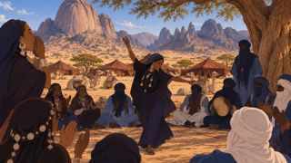](../renders/keyframes/S03-05.jpg) | `S03-05` | `02:16–02:22` | 6ث | KF2V | — | 🔊 ululation, murmurs | — | kf_done |
| 6 | [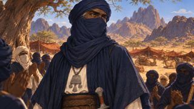](../renders/keyframes/S03-06.jpg) | `S03-06` | `02:22–02:30` | 8ث | KF2V | AMAMELLEN | راوية: كانوا يسمّونه «صاحب الوضوح». لم يغلبه لغزٌ قط. | — | kf_done |
| 7 | [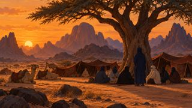](../renders/keyframes/S03-07.jpg) | `S03-07` | `02:30–02:38` | 8ث | T2V | — |  | — | kf_done |
| 8 | [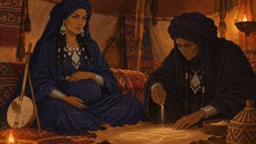](../renders/keyframes/S03-08.jpg) | `S03-08` | `02:38–02:46` | 8ث | KF2V | TANFUST | قارئة الرمل: الولد الذي في بطنك… سيرى أبعد من خاله. | — | kf_done |
| 9 | [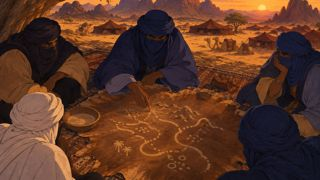](../renders/keyframes/S03-09.jpg) | `S03-09` | `02:46–02:52` | 6ث | KF2V | — |  | — | kf_done |
| 10 | [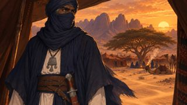](../renders/keyframes/S03-10.jpg) | `S03-10` | `02:52–03:00` | 8ث | KF2V | AMAMELLEN | 🔊 gust | — | kf_done |

### S04 — لعبة النقاط  `03:00–04:10`

| # | الصورة | اللقطة | الموضع | المدة | الطريقة | الشخصيات | الصوت | المقطع | الحالة |
|---|---|---|---|---|---|---|---|---|---|
| 1 | [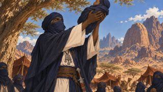](../renders/keyframes/S04-01.jpg) | `S04-01` | `03:00–03:07` | 7ث | KF2V | AMAMELLEN | 🔊 baby cry, ululation | — | kf_done |
| 2 | [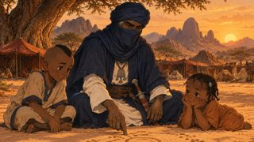](../renders/keyframes/S04-02.jpg) | `S04-02` | `03:07–03:16` | 9ث | KF2V | AMAMELLEN, ADELASEGH, TAFUKT | أمامّلن: نقطتان تعني «ماء». دائرة تعني «مخيّم». هذه لعبتنا… لا يعرفها أحدٌ غيرنا. | — | kf_done |
| 3 | [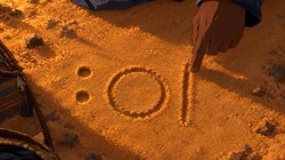](../renders/keyframes/S04-03.jpg) | `S04-03` | `03:16–03:23` | 7ث | KF2V | — |  | — | kf_done |
| 4 |  | `S04-04` | `03:23–03:29` | 6ث | KF2V | ADELASEGH, TAFUKT | 🔊 kids laughing | — | kf_done |
| 5 | [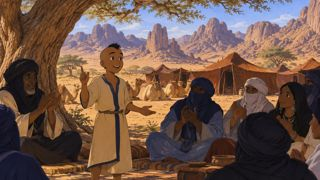](../renders/keyframes/S04-05.jpg) | `S04-05` | `03:29–03:36` | 7ث | KF2V | ADELASEGH |  | — | kf_done |
| 6 | [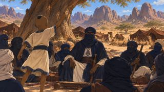](../renders/keyframes/S04-06.jpg) | `S04-06` | `03:36–03:44` | 8ث | KF2V | ADELASEGH, AMAMELLEN | أدلاسغ (12 سنة): الظلّ! يا خالي، الظلّ! | — | kf_done |
| 7 | [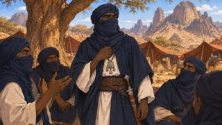](../renders/keyframes/S04-07.jpg) | `S04-07` | `03:44–03:50` | 6ث | KF2V | AMAMELLEN | 🔊 laughter | — | kf_done |
| 8 | [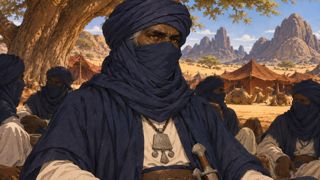](../renders/keyframes/S04-08.jpg) | `S04-08` | `03:50–03:58` | 8ث | KF2V | AMAMELLEN | راوية: ومنذ ذلك اليوم… صار في قلب الخال حجرٌ صغير. حجرٌ لم يكن ليّنًا. | — | kf_done |
| 9 | [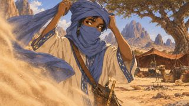](../renders/keyframes/S04-09.jpg) | `S04-09` | `03:58–04:10` | 12ث | KF2V | ADELASEGH | 🔊 wind whoosh, flute motif | — | kf_done |

### S05 — الفخ الأول: بئر كل إسوف  `04:10–05:30`

| # | الصورة | اللقطة | الموضع | المدة | الطريقة | الشخصيات | الصوت | المقطع | الحالة |
|---|---|---|---|---|---|---|---|---|---|
| 1 | [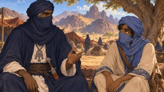](../renders/keyframes/S05-01.jpg) | `S05-01` | `04:10–04:18` | 8ث | KF2V | AMAMELLEN, ADELASEGH | أمامّلن: الماء في بئرنا مُرّ. اذهب إلى البئر البيضاء وراء السهل، وائتِنا بماءٍ عذب. | [mp4](../renders/clips/S05-01.mp4) | clip_done |
| 2 | [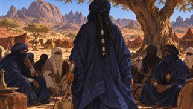](../renders/keyframes/S05-02.jpg) | `S05-02` | `04:18–04:24` | 6ث | KF2V | TANFUST | تانفوست: تلك بئر «كل إسوف»… لا يعود منها أحد. | — | kf_done |
| 3 | [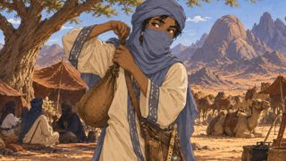](../renders/keyframes/S05-03.jpg) | `S05-03` | `04:24–04:30` | 6ث | KF2V | ADELASEGH | أدلاسغ: إذن سأكون أول من يعود. | — | kf_done |
| 4 | [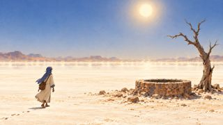](../renders/keyframes/S05-04.jpg) | `S05-04` | `04:30–04:38` | 8ث | T2V | ADELASEGH | 🔊 total silence, high whine | — | kf_done |
| 5 | [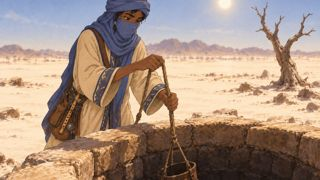](../renders/keyframes/S05-05.jpg) | `S05-05` | `04:38–04:45` | 7ث | KF2V | ADELASEGH |  | — | kf_done |
| 6 | [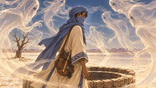](../renders/keyframes/S05-06.jpg) | `S05-06` | `04:45–04:53` | 8ث | KF2V | ADELASEGH | أرواح (همس): من يشرب من بئرنا… يبقى معنا. | — | kf_done |
| 7 |  | `S05-07` | `04:53–04:59` | 6ث | KF2V | ADELASEGH | أدلاسغ: لكم لغزٌ أولًا: من يقف أمامكم ولا تستطيعون لمسه؟ | — | kf_done |
| 8 | [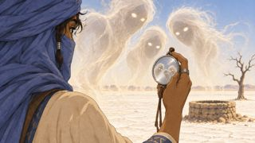](../renders/keyframes/S05-08.jpg) | `S05-08` | `04:59–05:07` | 8ث | KF2V | ADELASEGH |  | — | kf_done |
| 9 | [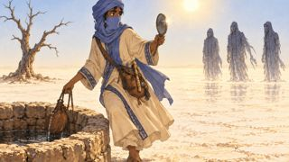](../renders/keyframes/S05-09.jpg) | `S05-09` | `05:07–05:15` | 8ث | KF2V | ADELASEGH | أدلاسغ: الجواب: أنتم. | — | kf_done |
| 10 | [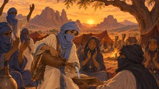](../renders/keyframes/S05-10.jpg) | `S05-10` | `05:15–05:23` | 8ث | KF2V | ADELASEGH | 🔊 cheers, ululation | — | kf_done |
| 11 | [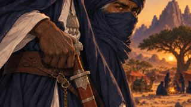](../renders/keyframes/S05-11.jpg) | `S05-11` | `05:23–05:30` | 7ث | KF2V | AMAMELLEN |  | — | kf_done |

### S06 — الفخ الثاني: القربة المثقوبة  `05:30–06:50`

| # | الصورة | اللقطة | الموضع | المدة | الطريقة | الشخصيات | الصوت | المقطع | الحالة |
|---|---|---|---|---|---|---|---|---|---|
| 1 | [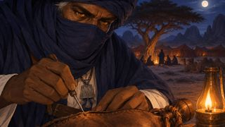](../renders/keyframes/S06-01.jpg) | `S06-01` | `05:30–05:38` | 8ث | KF2V | AMAMELLEN | 🔊 leather creak | — | kf_done |
| 2 | [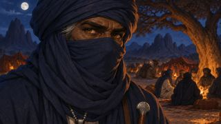](../renders/keyframes/S06-02.jpg) | `S06-02` | `05:38–05:44` | 6ث | KF2V | AMAMELLEN |  | — | kf_done |
| 3 | [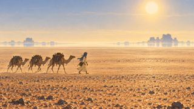](../renders/keyframes/S06-03.jpg) | `S06-03` | `05:44–05:52` | 8ث | T2V | ADELASEGH | راوية: أرسله خاله بقافلة إلى تنزروفت… أرض العطش، بقربة تبكي ماءها قطرةً قطرة. | — | kf_done |
| 4 | [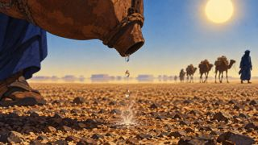](../renders/keyframes/S06-04.jpg) | `S06-04` | `05:52–05:58` | 6ث | KF2V | — | 🔊 drip, sizzle | — | kf_done |
| 5 | [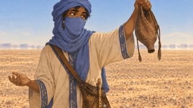](../renders/keyframes/S06-05.jpg) | `S06-05` | `05:58–06:05` | 7ث | KF2V | ADELASEGH |  | — | kf_done |
| 6 | [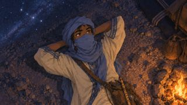](../renders/keyframes/S06-06.jpg) | `S06-06` | `06:05–06:13` | 8ث | KF2V | ADELASEGH | 🔊 night wind, jackal far | — | kf_done |
| 7 | [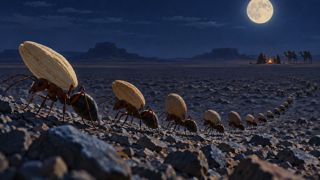](../renders/keyframes/S06-07.jpg) | `S06-07` | `06:13–06:20` | 7ث | KF2V | — | أدلاسغ (لنفسه): النمل لا يحمل حبًّا إلى حيث لا ماء. | — | kf_done |
| 8 | [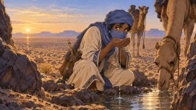](../renders/keyframes/S06-08.jpg) | `S06-08` | `06:20–06:28` | 8ث | KF2V | ADELASEGH | 🔊 water splash, camel groan | — | kf_done |
| 9 | [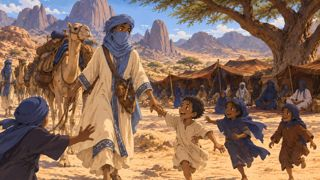](../renders/keyframes/S06-09.jpg) | `S06-09` | `06:28–06:36` | 8ث | KF2V | ADELASEGH | 🔊 kids shouting | — | kf_done |
| 10 | [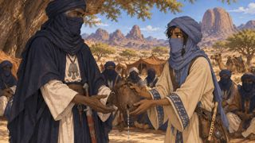](../renders/keyframes/S06-10.jpg) | `S06-10` | `06:36–06:43` | 7ث | KF2V | AMAMELLEN, ADELASEGH | أدلاسغ: قربتك يا خالي… كانت عطشى أكثر مني. | — | kf_done |
| 11 | [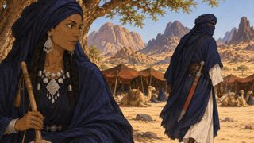](../renders/keyframes/S06-11.jpg) | `S06-11` | `06:43–06:50` | 7ث | KF2V | TANFUST, AMAMELLEN | 🔊 silence | — | kf_done |

### S07 — الفخ الثالث: صدع الأسكرام  `06:50–08:20`

| # | الصورة | اللقطة | الموضع | المدة | الطريقة | الشخصيات | الصوت | المقطع | الحالة |
|---|---|---|---|---|---|---|---|---|---|
| 1 | [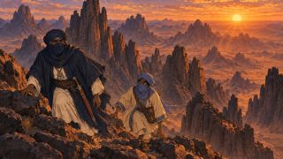](../renders/keyframes/S07-01.jpg) | `S07-01` | `06:50–06:58` | 8ث | T2V | AMAMELLEN, ADELASEGH | 🔊 high wind | — | kf_done |
| 2 | [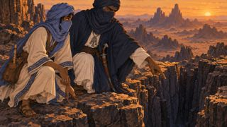](../renders/keyframes/S07-02.jpg) | `S07-02` | `06:58–07:05` | 7ث | KF2V | AMAMELLEN, ADELASEGH | أمامّلن: في قاع ذلك الصدع نبتة لا تنبت إلا هنا. أمّك مريضة… انزل. | — | kf_done |
| 3 | [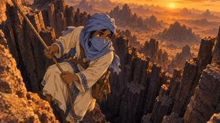](../renders/keyframes/S07-03.jpg) | `S07-03` | `07:05–07:11` | 6ث | KF2V | ADELASEGH |  | — | kf_done |
| 4 | [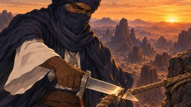](../renders/keyframes/S07-04.jpg) | `S07-04` | `07:11–07:17` | 6ث | KF2V | AMAMELLEN | 🔊 rope snap | — | kf_done |
| 5 |  | `S07-05` | `07:17–07:23` | 6ث | KF2V | ADELASEGH | 🔊 then silence | — | kf_done |
| 6 |  | `S07-06` | `07:23–07:30` | 7ث | KF2V | AMAMELLEN |  | — | kf_done |
| 7 |  | `S07-07` | `07:30–07:37` | 7ث | KF2V | ADELASEGH |  | — | kf_done |
| 8 |  | `S07-08` | `07:37–07:45` | 8ث | KF2V | ADELASEGH | 🔊 effort breaths | — | kf_done |
| 9 |  | `S07-09` | `07:45–07:53` | 8ث | KF2V | AMAMELLEN, ADELASEGH |  | — | kf_done |
| 10 |  | `S07-10` | `07:53–08:00` | 7ث | KF2V | AMAMELLEN, ADELASEGH |  | — | kf_done |
| 11 |  | `S07-11` | `08:00–08:10` | 10ث | KF2V | AMAMELLEN, ADELASEGH | أدلاسغ: لغزٌ يا خالي. ما الذي لا يستطيع الأب أن يعطيه… ولا يستطيع الخال أن يأخذه… ويحمله ابن الأخت؟ | — | kf_done |
| 12 |  | `S07-12` | `08:10–08:20` | 10ث | KF2V | AMAMELLEN | أمامّلن: …الدم. دم أمّك. اسمي… من بعدي. | — | kf_done |

### S08 — المصالحة وتصلّب الحجر  `08:20–09:30`

| # | الصورة | اللقطة | الموضع | المدة | الطريقة | الشخصيات | الصوت | المقطع | الحالة |
|---|---|---|---|---|---|---|---|---|---|
| 1 |  | `S08-01` | `08:20–08:29` | 9ث | KF2V | AMAMELLEN, ADELASEGH |  | [mp4](../renders/clips/S08-01.mp4) | clip_done |
| 2 |  | `S08-02` | `08:29–08:38` | 9ث | KF2V | AMAMELLEN | أمامّلن: لم أكن أخاف منك. كنت أخاف أن تراني أصغُر… أن يأتي يومٌ لا يذكرني فيه أحد. | — | kf_done |
| 3 |  | `S08-03` | `08:38–08:45` | 7ث | KF2V | ADELASEGH | أدلاسغ: وكيف يُنسى من حفر كل هذه الألغاز في رؤوسنا؟ | — | kf_done |
| 4 |  | `S08-04` | `08:45–08:54` | 9ث | T2V | — | 🔊 music rises | — | kf_done |
| 5 |  | `S08-05` | `08:54–09:02` | 8ث | KF2V | AMAMELLEN, ADELASEGH |  | — | kf_done |
| 6 |  | `S08-06` | `09:02–09:12` | 10ث | T2V | — | راوية: في ذلك الفجر… تصلّبت الحجارة. ولم يعد أحدٌ يترك أثرًا. | — | kf_done |
| 7 |  | `S08-07` | `09:12–09:20` | 8ث | KF2V | AMAMELLEN |  | — | kf_done |
| 8 |  | `S08-08` | `09:20–09:30` | 10ث | KF2V | AMAMELLEN, ADELASEGH | أمامّلن: انتهى زمن الأثر يا ابن أختي. | — | kf_done |

### S09 — الغبار في الأفق  `09:30–10:00`

| # | الصورة | اللقطة | الموضع | المدة | الطريقة | الشخصيات | الصوت | المقطع | الحالة |
|---|---|---|---|---|---|---|---|---|---|
| 1 |  | `S09-01` | `09:30–09:38` | 8ث | KF2V | ADELASEGH, AMAMELLEN | أدلاسغ: خالي… تافوكت في المخيّم. | — | kf_done |
| 2 |  | `S09-02` | `09:38–09:46` | 8ث | T2V | — | 🔊 distant rumble | — | kf_done |
| 3 |  | `S09-03` | `09:46–09:52` | 6ث | KF2V | AMAMELLEN | 🔊 sound drops out, single tende drum hit | — | kf_done |
| 4 | رسوم HF | `S09-04` | `09:52–10:00` | 8ث | HF | — |  | [mp4](../renders/clips/S09-04.mp4) | clip_done |

## الجزء 2

### S10 — الغارة (لم تُكتب لقطاته بعد)

### S11 — لا أثر (لم تُكتب لقطاته بعد)

### S12 — آخر العمالقة (لم تُكتب لقطاته بعد)

### S13 — مبارزة الألغاز والهروب (لم تُكتب لقطاته بعد)

### S14 — اختراع الحروف (لم تُكتب لقطاته بعد)

### S15 — قراءة العلامات (لم تُكتب لقطاته بعد)

### S16 — الصخرة الأخيرة (لم تُكتب لقطاته بعد)

### S17 — تصلّبت الحجارة كي تبقى الكلمات (لم تُكتب لقطاته بعد)

### S18 — الخاتمة (لم تُكتب لقطاته بعد)
